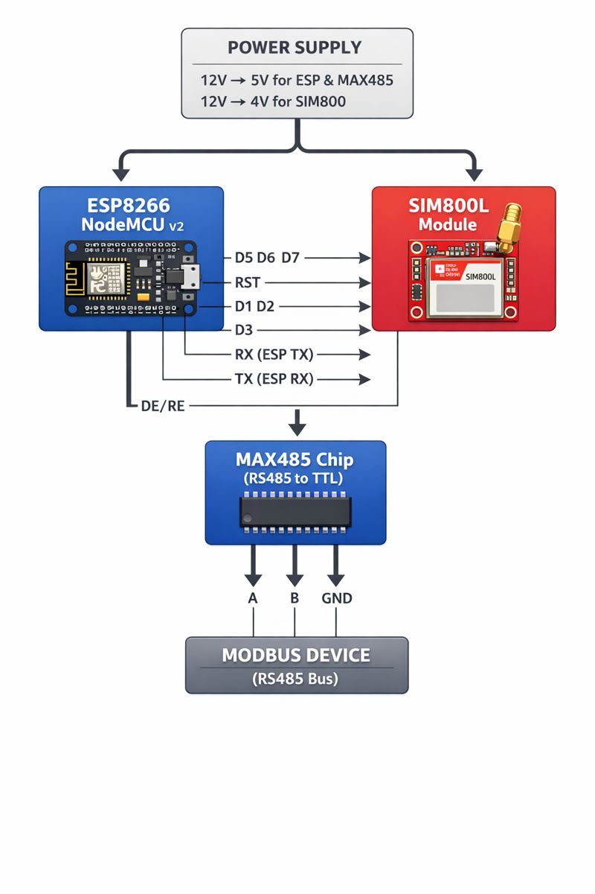

# Modbus to MQTT Gateway for HVAC (POL6x8.XX/STD) Systems for Climatix Siemens Controller.

### A complete PlatformIO project for converting Modbus RTU registers to MQTT messages using ESP8266 (NodeMCU v2) and SIM800L cellular module.

## Features

- ✅ Reads all Modbus registers defined in configuration
- ✅ Publishes data to MQTT server via cellular connection
- ✅ Accepts MQTT commands to write to Modbus registers
- ✅ Supports all register types: Coils, Discrete Inputs, Input Registers, Holding Registers
- ✅ Automatic reconnection on network loss
- ✅ Configurable via JSON file
- ✅ Comprehensive error handling
- ✅ Unit tests for validation
- ✅ Status LED indicating system state

## Register Documentation
- The system supports all registers defined in registers_config.h:
- Heating Circuit Valves - Control valves for heating circuits
- Heating Pumps - Pump control and monitoring
- DHW Valves - Domestic hot water control
- DHW Pumps - Hot water circulation pumps
- Makeup Valves/Pumps - System makeup water control
- Alarms - System fault and diagnostic registers
- Pressure Sensors - System pressure monitoring
- Temperature Sensors - Temperature measurements
- Command Registers - Control commands
- Counters - Runtime and energy statistics
- System Info - Device information

## Hardware Requirements

- NodeMCU v2 (ESP8266)
- SIM800L GSM/GPRS Module
- MAX485 RS485 to TTL Converter
- 12V to 5V/3.3V Power Supply
- RS485 Modbus Devices (HVAC controllers)

## Wiring Diagram
NodeMCU <-> SIM800L
D1 (TX) -> SIM800L RX
D2 (RX) <- SIM800L TX
D3 -----> SIM800L PWR
D4 -----> SIM800L RST

NodeMCU <-> MAX485
D5 (RX) <- MAX485 RO
D6 (TX) -> MAX485 DI
D7 -----> MAX485 DE/RE

MAX485 <-> Modbus Devices
A -> RS485 A
B -> RS485 B
GND -> Common Ground


## Visual Connection Diagram:




## Installation

1. Install PlatformIO in VS Code
2. Clone this repository
3. Install dependencies:
   ```bash
   pio lib install "ArduinoJson"
   pio lib install "ottowinter/ModbusMaster"
   pio lib install "TinyGSM"


   Configure data/config.json:

Set your MQTT server details

Configure APN for your cellular provider

Adjust polling intervals as needed

## Upload filesystem:
pio run --target uploadfs
## Build and upload:
pio run --target upload

##MQTT Topics
modbus/<client-id>/data - All register data (JSON)

modbus/<client-id>/command - Send commands to

modbus/<client-id>/response - Command responses

modbus/<client-id>/status - System status

modbus/registers/<register-name> - Individual registers

## Sending Commands
### Example command to write to a holding register:

bash
mosquitto_pub -h mqtt.server.com -t "modbus/gateway-abc123/command" \
  -m '{
    "address": 256,
    "value": 25.5,
    "type": "holding",
    "command_id": "cmd123"
  }'


